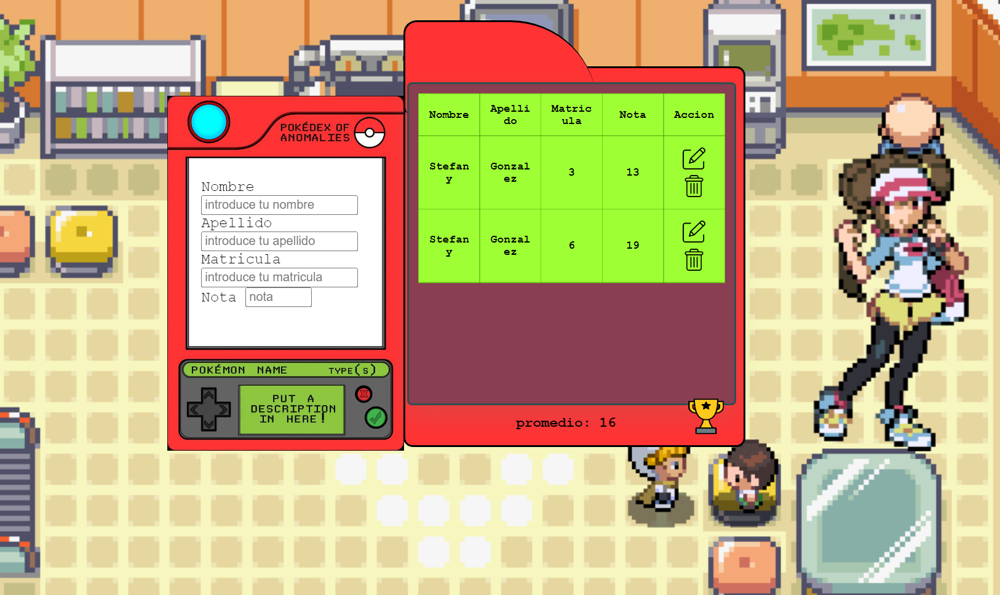

### pokedex-form-table

A form that stores data in a table. Pokedex-inspired design.

## Usage

* Visit [pokedex-form-table](https://stefanygonzalezleon.github.io/pokedex-form-table-/)
* Add, Edit and delete data from the table.
* Average inserted note is displayed.

## Features

* Storing data in local storage.
* Stored data CRUD.
* Actions followed by dynamic audio.

## Author

- [@stefanygonzalezleon](https://www.github.com/stefanygonzalezleon)